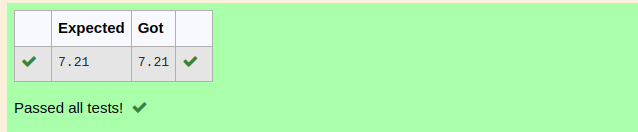

# DISTANCE-BETWEEN-TWO-POINTS

## AIM:
To write a python program to find the distance two 2 points
## ALGORITHM:
### Step 1: 
enter a import function
### Step 2: 
enter the values l1 l2
### Step 3: 
Substitute the values in the distance formula  
### Step 4: 
store the values in variable
### Step 5: 
print the values
### PROGRAM:
```
#Program to find the distance between two points.
#Developed by: adhithya perumal.d
#RegisterNumber:22008747
import math as m
l1=[4,2]
l2=[10,6]
d=m.sqrt((l2[0]-l1[0])**2+(l2[1]-l1[1])**2)
print("{:.2f}".format(d))
```
  


### OUTPUT:



### RESULT:
thus the distance between two points successfully executed